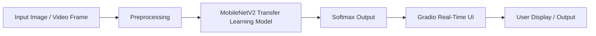

# ♻️ Real-Time Waste Classification System / 基于两阶段迁移学习的实时垃圾分类系统

[]()
[]()
[]()
[]()
[]()

> 🧠 **A lightweight end-to-end deep learning system for real-time waste classification, integrating TrashNet and TACO datasets, trained with MobileNetV2, and deployed via Gradio + Docker.**  
> 一个轻量化的端到端垃圾分类系统，融合 TrashNet 与 TACO 数据集，采用 MobileNetV2 两阶段迁移学习，并通过 Gradio + Docker 实现实时识别与部署。

---

## 📚 Table of Contents / 目录

1. [Overview / 项目概述](#overview--项目概述)
2. [Features / 功能特性](#features--功能特性)
3. [System Architecture / 系统架构](#system-architecture--系统架构)
4. [Dataset & Preprocessing / 数据集与预处理](#dataset--preprocessing--数据集与预处理)
5. [Model & Training / 模型设计与训练](#model--training--模型设计与训练)
6. [Experiment & Results / 实验结果](#experiment--results--实验结果)
7. [Deployment / 系统部署](#deployment--系统部署)
8. [Project Structure / 项目结构](#project-structure--项目结构)
9. [Future Work / 未来展望](#future-work--未来展望)
10. [Acknowledgments / 致谢与引用](#acknowledgments--致谢与引用)
11. [License / 开源协议](#license--开源协议)

---

## Overview / 项目概述

This project builds a **real-time waste classification system** using **MobileNetV2** and **two-stage transfer learning**.  
It fuses **TrashNet** and **TACO** datasets to achieve both class clarity and real-world robustness.

本项目旨在实现一个基于 **两阶段迁移学习** 的 **实时垃圾分类系统**，通过整合 TrashNet 与 TACO 数据集，实现了从数据清洗、模型训练到部署的完整流程。

**Key Highlights / 核心亮点：**
- ✅ 数据层：融合 TrashNet + TACO 构建高质量训练源  
- ✅ 模型层：采用 MobileNetV2 的两阶段迁移学习（特征提取 + 微调）  
- ✅ 应用层：Gradio 实时识别 Web 界面  
- ✅ 部署层：Docker 一键容器化运行

---

## Features / 功能特性

| Module 模块 | Description 描述 | Technology 技术 |
|--------------|------------------|-----------------|
| Data Processing 数据处理 | 自动解析 TACO JSON 标注并裁剪目标 | Python, OpenCV |
| Model Training 模型训练 | 两阶段迁移学习策略 | TensorFlow, Keras |
| Real-Time Classification 实时识别 | 摄像头实时视频流分类 | Gradio |
| Deployment 部署封装 | Docker 容器化部署 | Docker |

---

## System Architecture / 系统架构



---

## Dataset & Preprocessing / 数据集与预处理

### 🗂 Sources / 数据来源
| Dataset | Link | Description |
|----------|------|-------------|
| **TrashNet** | [GitHub](https://github.com/garythung/trashnet) | Clean, structured dataset |
| **TACO** | [Official Site](https://tacodataset.org) | Real-world images with COCO annotations |

### ⚙️ Processing Workflow / 处理流程

1. 定义统一类别：Cardboard / Glass / Metal / Paper / Plastic / Trash  
2. 解析 TACO 的 COCO JSON 文件，自动裁剪物体区域  
3. 与 TrashNet 样本合并并统一标签  
4. 图像增强（翻转、旋转、亮度调整）  
5. 划分训练 / 验证 / 测试集 (70/15/15)  
6. 统一尺寸：224×224×3

> 💾 完整数据集未随仓库上传，可从 [TrashNet](https://github.com/garythung/trashnet) 与 [TACO](https://tacodataset.org) 下载。

---

## Model & Training / 模型设计与训练

**Base Model / 基础模型**  
`MobileNetV2 (Pretrained on ImageNet)`  
+ `GlobalAveragePooling2D → Dropout(0.5) → Dense(Softmax)`

| Phase 阶段 | Trainable Layers 训练部分 | Learning Rate 学习率 | Accuracy 准确率 |
|-------------|---------------------------|-----------------------|----------------|
| Feature Extraction 特征提取 | 仅训练分类头 | 1e-3 | 89% |
| Fine-Tuning 微调阶段 | 解冻顶部卷积层 | 1e-5 | 90% |

> Two-stage transfer learning improves convergence speed and adaptability.  
> 两阶段迁移学习有效提高了模型收敛速度与泛化能力。

---

## Experiment & Results / 实验结果

**Environment / 实验环境：**
- Python 3.10, TensorFlow 2.16.1 (CPU)
- Libraries: Gradio, OpenCV, NumPy
- Deployment: Docker Container

**Performance / 性能表现：**
| Stage 阶段 | Validation Accuracy 验证集准确率 | Test Accuracy 测试集准确率 |
|-------------|----------------------------------|-----------------------------|
| Feature Extraction | 0.89 | 0.88 |
| Fine-Tuning | 0.91 | 0.90 |

> 实时识别延迟低于 0.5 秒/帧，具备良好的实时性与稳定性。

---

## Deployment / 系统部署

### 🧩 Run Locally / 本地运行
```bash
pip install -r requirements.txt
python app.py
```

访问 [http://127.0.0.1:7860](http://127.0.0.1:7860) 查看 Gradio 界面。

### 🐳 Docker Deployment / Docker 部署
```bash
docker build -t waste-classification .
docker run -p 7860:7860 waste-classification
```

> 打开 [http://localhost:7860](http://localhost:7860) 即可实时识别垃圾类别。

---

## Project Structure / 项目结构
```
real-time-waste-classification/
├── app.py
├── requirements.txt
├── Dockerfile
├── config.py
├── notebooks/train_model.ipynb
├── data_preprocessing/
│   ├── combine_trashnet_taco.py
│   ├── parse_taco_json.py
│   └── README.md
├── processed_dataset_sample/
├── saved_models/
│   └── best_model_finetuned.keras
├── assets/demo.gif
└── README.md
```

---

## Future Work / 未来展望

- 🔍 引入注意力机制 (e.g. SE-Block) 提升特征表达  
- 🧱 在 Jetson Nano / 树莓派 上实现边缘部署  
- 📦 融合文本或语音输入的多模态识别  
- 🌍 扩展垃圾分类种类与场景  

---

## Acknowledgments / 致谢与引用

Thanks to the following datasets and tools:  
- [TrashNet Dataset](https://github.com/garythung/trashnet)  
- [TACO Dataset](https://tacodataset.org)  
- [Gradio](https://www.gradio.app/)  
- [TensorFlow](https://www.tensorflow.org/)  
- [Docker](https://www.docker.com/)

### References / 参考文献
1. 李金玉 等. *基于深度学习的垃圾分类方法综述.* 计算机工程, 2022.  
2. Liu Xuetao. *Real-Time Classification and Detection of Garbage Based on Improved Yolov5.* IEEE, 2023.  
3. 陈胜娣. *基于迁移学习的垃圾分类平台设计与实现.* 计算机时代, 2025.  

---

## License / 开源协议

This project is released under the [MIT License](LICENSE).  
项目遵循 MIT 开源协议，仅供教学与研究使用。

---

## Author / 作者

👤 **Kangle Pei**  
📧 pkangle@example.com  
💼 GitHub: [@pkangle](https://github.com/pkangle)

> ⭐ If you find this project helpful, please give it a star!  
> 如果本项目对你有帮助，请为它点亮一颗 Star！
